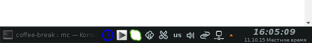
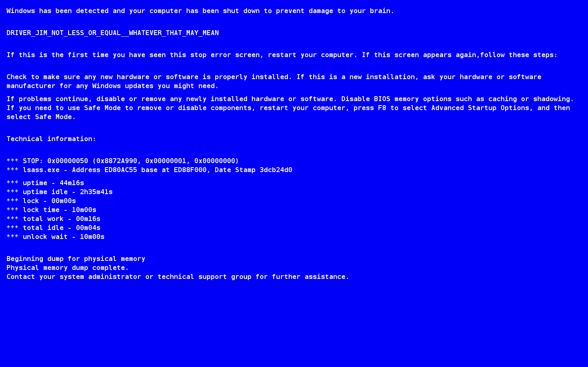

Coffee Break v1
------------

Эта небольшая программа позволяет установить таймер, который предупредит Вас, чтобы сделать перерыв 10 минут.
Доступные таймеры: 5м,10м,15м,20м,25м,30м,45м,2ч,3ч,4ч. Присутсвует возможность включить/отключить звуковой сигнал.
Визуальное оповещение о последующей блокировке экрана, и клавиатуры. Блокировка экрана, сопровождается незательевой заставкой, в стиле матрицы.


Прграмма в работе, таймер рабочего времени включен:




Программа в состоянии блокировка, либо ожидается блок через одну минуту, о чем оповещает красный значек:


Программа находится в состоянии паузы, все процессы, и таймеры заморожены:


Быстрый доступ к настройкам через значёк в системном лотке.


Экран блокировки, включающий следующую информацию:
    1) суммарно работы рабочей станции
    2) суммарно простоя рабочей станции
    3) суммарно блокировки
    4) блокировки
    5) суммарно работы
    6) суммарно простоя
    7) обратный отсчёт до разблокировки

matrix


windows bsod screen



ide work simulate


#### Сборка из исходников

```bash
git clone git@github.com:e154/coffee-break.git
cd coffee-break
make clean && make
```
на выходе получаем deb пакет, который устанавливаем системным пакетным менеджером.

#### Установка deb пакета, debian|ubuntu

```bash
sudo dpkg -i coffee-break*.deb
sudo apt-get install -f
```

#### Удаление

```bash
sudo apt-get remove coffee-break
```

#### Зависимости

```bash
go get golang.org/x/mobile/exp/audio
go get github.com/astaxie/beego/config
go get github.com/gorilla/websocket
go get github.com/c9s/goprocinfo/linux
go get github.com/looplab/fsm
go get github.com/mattn/go-gtk/glib

apt-get install libopenal-dev libnotify-dev libxss-dev md5deep libglib2.0-dev libqt5webkit5-dev
```

#### LICENSE

Coffee Break is licensed under the [MIT License (MIT)](https://github.com/e154/coffee-break/blob/master/LICENSE).